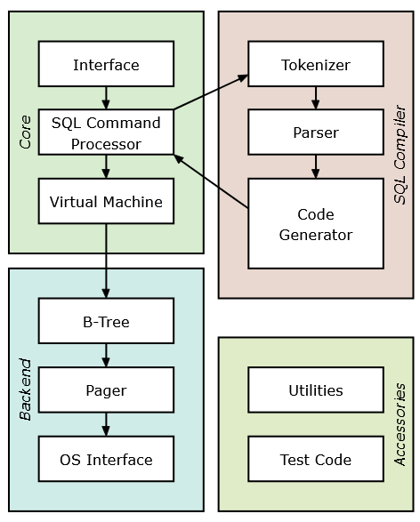

In this project, I will be building a fully functional relational database using Python that executes SQL statements. This is a project that will help me understand relational databases more and practice my programming/engineering skills.

This project will use SQLlite's architecture: https://www.sqlite.org/arch.html

